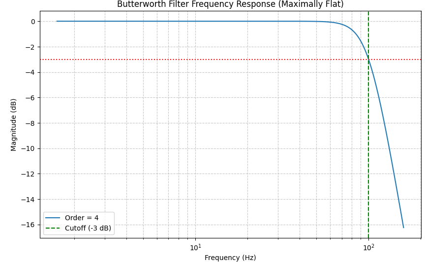

  <h1>🎛️ Butterworth Polynomials & Filter Design</h1>
  

    <b>A comprehensive mathematical guide and engineering reference for maximally flat frequency response filters.</b>
  

  

    <a href="#overview">Overview</a> •
    <a href="#mathematical-foundation">Mathematics</a> •
    <a href="#polynomial-table">Polynomial Table</a> •
    <a href="#applications">Applications</a> •
    <a href="#code-examples">Implementation</a> •
    <a href="#visual-output">Visual Output</a>
  

<h2 id="overview">📖 Overview</h2>

  The <b>Butterworth filter</b> is a type of signal processing filter designed to have a frequency response that is as flat as mathematically possible in the passband. It is often referred to as a <b>maximally flat magnitude filter</b>. 

  First described by British engineer and physicist <i>Stephen Butterworth</i> in 1930, these filters rely on a specific sequence of polynomials—known as <b>Butterworth Polynomials</b>—to construct transfer functions without passband or stopband ripple.

<h2 id="mathematical-foundation">📐 Mathematical Foundation</h2>

<h3>1. Magnitude Squared Response</h3>

  The frequency response of an $n$-th order Butterworth low-pass filter with a cutoff frequency $\omega_c$ is given by:

  $$|H(j\omega)|^2 = \frac{1}{1 + \left(\frac{\omega}{\omega_c}\right)^{2n}}$$

<ul>
  <li><b>$n$</b>: Filter order (determines the roll-off rate: $-20n$ dB/decade).</li>
  <li><b>$\omega_c$</b>: Cutoff frequency (where the power drops by half, or $-3\text{ dB}$).</li>
  <li><b>$\omega$</b>: Angular frequency.</li>
</ul>

<h3>2. The Butterworth Polynomials $B_n(s)$</h3>

  By analytically continuing $s = j\omega$, the normalized transfer function $H(s)$ can be expressed in terms of the Butterworth polynomial $B_n(s)$:

  $$H(s) = \frac{1}{B_n(s)}$$

  The poles of $H(s)$ are located symmetrically on the unit circle in the complex $s$-plane, separated by equal angles of $\frac{\pi}{n}$. To ensure system stability, $B_n(s)$ is constructed using strictly the left-half-plane (LHP) poles:

  $$s_k = \exp\left(j \frac{2k + n - 1}{2n}\pi\right), \quad k = 1, 2, \dots, n$$

<h2 id="polynomial-table">📊 Normalized Butterworth Polynomials ($B_n(s)$)</h2>

  Below are the factored and expanded forms of normalized Butterworth polynomials up to order $n = 8$:

<table border="1" cellpadding="8" cellspacing="0" width="100%">
  <thead>
    <tr bgcolor="#f2f2f2">
      <th align="center">Order ($n$)</th>
      <th align="left">Factored Form</th>
      <th align="left">Expanded Form</th>
    </tr>
  </thead>
  <tbody>
    <tr>
      <td align="center"><b>1</b></td>
      <td>$(s + 1)$</td>
      <td>$s + 1$</td>
    </tr>
    <tr>
      <td align="center"><b>2</b></td>
      <td>$(s^2 + 1.4142s + 1)$</td>
      <td>$s^2 + \sqrt{2}s + 1$</td>
    </tr>
    <tr>
      <td align="center"><b>3</b></td>
      <td>$(s + 1)(s^2 + s + 1)$</td>
      <td>$s^3 + 2s^2 + 2s + 1$</td>
    </tr>
    <tr>
      <td align="center"><b>4</b></td>
      <td>$(s^2 + 0.7654s + 1)(s^2 + 1.8478s + 1)$</td>
      <td>$s^4 + 2.6131s^3 + 3.4142s^2 + 2.6131s + 1$</td>
    </tr>
    <tr>
      <td align="center"><b>5</b></td>
      <td>$(s + 1)(s^2 + 0.6180s + 1)(s^2 + 1.6180s + 1)$</td>
      <td>$s^5 + 3.2361s^4 + 5.2361s^3 + 5.2361s^2 + 3.2361s + 1$</td>
    </tr>
    <tr>
      <td align="center"><b>6</b></td>
      <td>$(s^2 + 0.5176s + 1)(s^2 + 1.4142s + 1)(s^2 + 1.9319s + 1)$</td>
      <td>$s^6 + 3.8637s^5 + 7.4641s^4 + 9.1416s^3 + 7.4641s^2 + 3.8637s + 1$</td>
    </tr>
    <tr>
      <td align="center"><b>7</b></td>
      <td>$(s + 1)(s^2 + 0.4450s + 1)(s^2 + 1.2470s + 1)(s^2 + 1.8019s + 1)$</td>
      <td>$s^7 + 4.4940s^6 + 10.0978s^5 + 14.5918s^4 + 14.5918s^3 + 10.0978s^2 + 4.4940s + 1$</td>
    </tr>
    <tr>
      <td align="center"><b>8</b></td>
      <td>$(s^2 + 0.3902s + 1)(s^2 + 1.1111s + 1)(s^2 + 1.6629s + 1)(s^2 + 1.9616s + 1)$</td>
      <td>$s^8 + 5.1258s^7 + 13.1371s^6 + 21.8462s^5 + 25.6884s^4 + 21.8462s^3 + 13.1371s^2 + 5.1258s + 1$</td>
    </tr>
  </tbody>
</table>

<h2 id="applications">🚀 Applications</h2>

<table width="100%">
  <tr>
    <td width="50%" valign="top">
      <h3>🎧 Audio Signal Processing</h3>
      

        Used extensively in audio crossovers and anti-aliasing filters. Because of the flat passband, Butterworth filters prevent artificial coloring of audio frequencies before digital-to-analog conversion or speaker distribution.
      

    </td>
    <td width="50%" valign="top">
      <h3>🏥 Biomedical Engineering</h3>
      

        Vital for filtering biological signals like <b>ECG</b>, <b>EEG</b>, and <b>EMG</b>. High-order Butterworth filters remove baseline wander and high-frequency noise without distorting the underlying clinical waveform morphology in the passband.
      

    </td>
  </tr>
  <tr>
    <td width="50%" valign="top">
      <h3>📡 RF & Communications</h3>
      

        In radio frequency receivers, they act as channel selection filters. Their monotonic roll-off ensures predictable attenuation of adjacent interfering channels without phase distortion spikes in the primary band.
      

    </td>
    <td width="50%" valign="top">
      <h3>🖼️ Image Processing</h3>
      

        Applied in 2D Fourier domain filtering for image smoothing (low-pass) or edge enhancement (high-pass). Unlike ideal brick-wall filters, Butterworth filters avoid creating severe ringing artifacts (Gibbs phenomenon) around edges.
      

    </td>
  </tr>
</table>

<h2 id="code-examples">💻 Implementation (Python / SciPy)</h2>

  Designing and analyzing an analog Butterworth filter using standard scientific Python libraries:

<pre><code class="language-python">import numpy as np
import matplotlib.pyplot as plt
from scipy import signal

# 1. Filter Specifications
order = 4
cutoff_freq = 100.0  # Cutoff frequency in Hz
cutoff_rad = 2 * np.pi * cutoff_freq  # Convert to rad/s for SciPy analog filter

# 2. Design Analog Butterworth Filter (Low-pass)
b, a = signal.butter(N=order, Wn=cutoff_rad, btype='low', analog=True)

# 3. Compute Frequency Response
w, h = signal.freqs(b, a, worN=np.logspace(1, 3, 500))
frequencies_hz = w / (2 * np.pi)

# 4. Plot Magnitude Response
plt.figure(figsize=(10, 6))
plt.semilogx(frequencies_hz, 20 * np.log10(abs(h)), label=f'Order = {order}')
plt.title('Butterworth Filter Frequency Response (Maximally Flat)')
plt.xlabel('Frequency (Hz)')
plt.ylabel('Magnitude (dB)')
plt.axvline(cutoff_freq, color='green', linestyle='--', label='Cutoff (-3 dB)')
plt.axhline(-3, color='red', linestyle=':')
plt.grid(True, which='both', axis='both', linestyle='--', alpha=0.7)
plt.legend()
plt.show()
</code></pre>

<h3 id="visual-output">📈 Visual Output</h3>

  Running the Python script generates the following frequency response visualization, illustrating the maximally flat passband and the characteristic roll-off rate:

  

  Distributed under the MIT License. Built for signal processing engineers and researchers.

